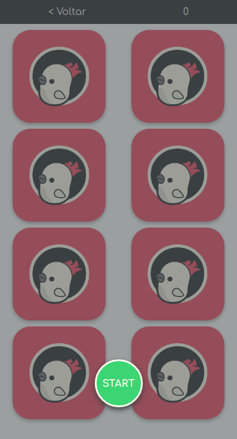

# Memory Game

# Jogo da memória feito com JS puro
### Este jogo esta sendo desenvolvido com os padrões  ITCSS e RSCSS
### Este game está em desenvolvimento, contém pequenos bugs ainda

# Informações

- Objects são elementos estruturais ou componentes muito simples.

- Componentes são elementos separados em blocos que podem ser reutilizados. componentes stateless, componentes "burros"

- Pages cuida de como inserir os elementos na tela e passa as informações para os componentes. 

- Callback: Chamada de retorno, função que só é executada quando ocorre uma ação (usuário clica)
